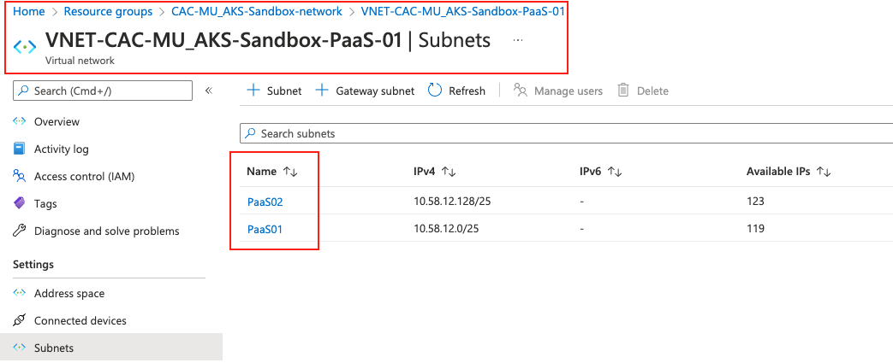
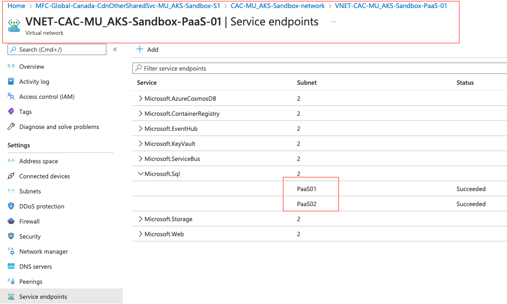
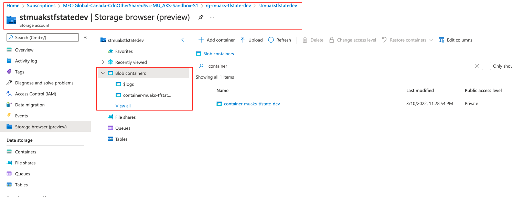
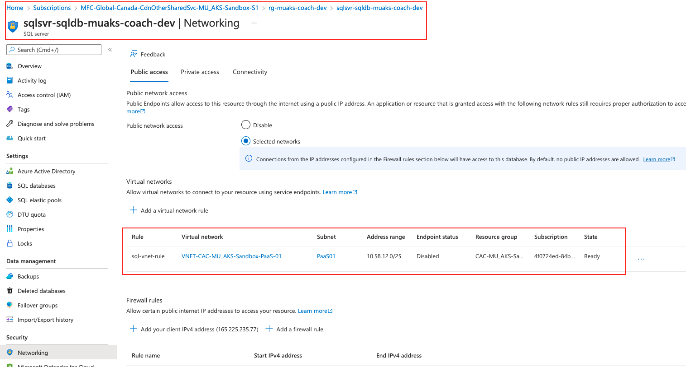
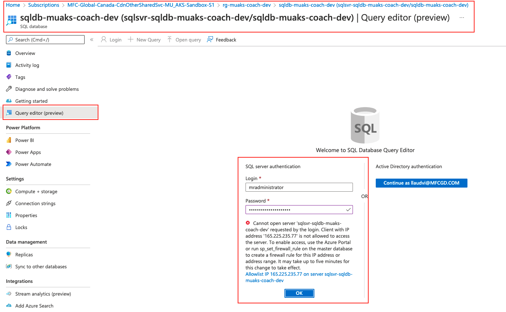
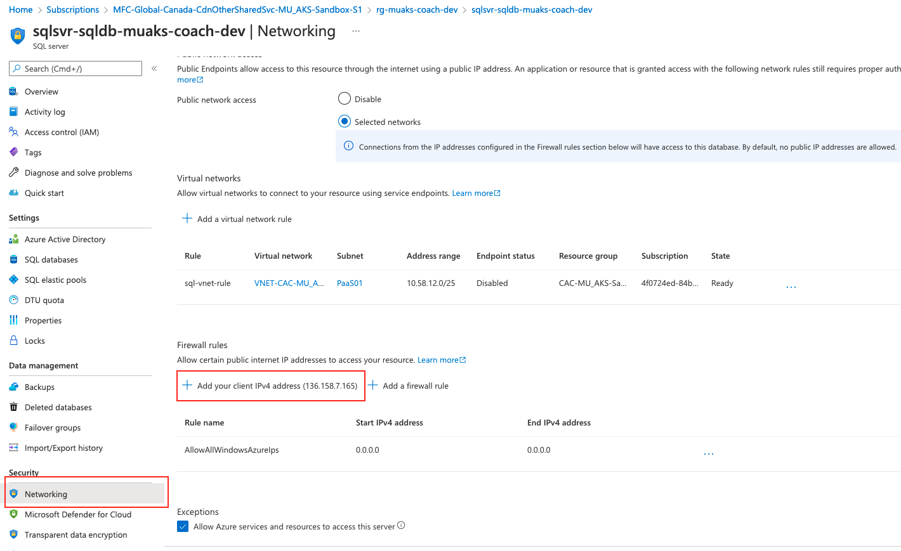
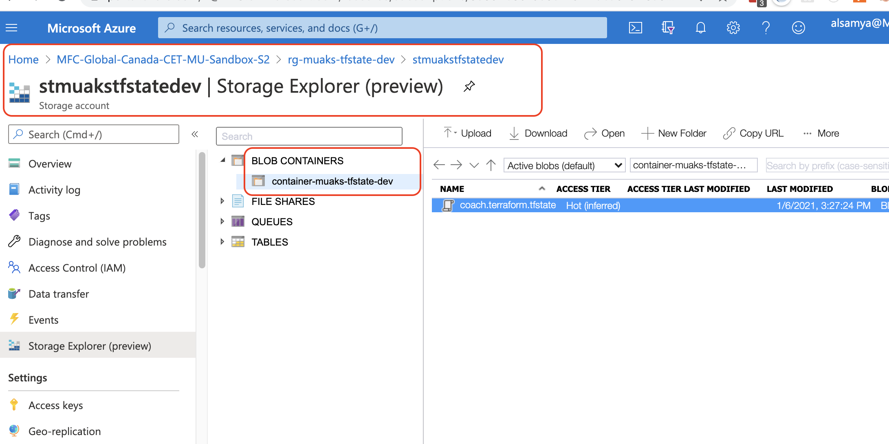
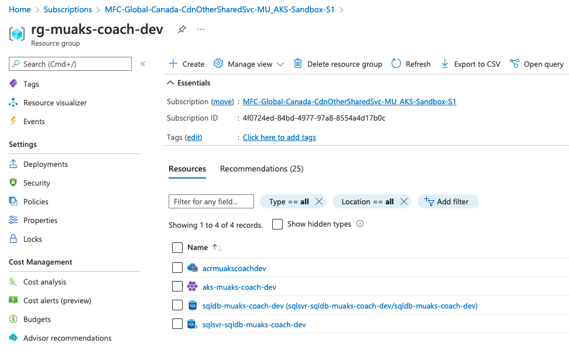

# David Sunico (sunicda-mu-aks-terraform)

Manulife University - Journey to AKS Program, Terraform starter application.

# AKS infrastructure as a service (Terraform) lab

## Goal

To demonstrate how to provision resources in Azure using Terraform.

You will be using helper modules that we prepared for you. In the future, once they're ready, you'll be able to use the ES Cloud Marketplace templates (available at https://github.com/manulife-ca/es-cloud-terraforms-cloud-templates).

Jump to:

1. [Lab 0 Prerequisites](#lab-0-prerequisites)
1. [Lab 1 Login to Azure CLI](#lab-1-login-to-azure-cli)
1. [Lab 2 Terraform Repo Setup](#lab-2-terraform-repo-setup)
1. [Lab 3 Provision Azure SQL Singleton DB](#lab-3-provision-azure-sql-singleton-db)
1. [Lab 4 Use Azure Storage as Terraform Backend](#lab-4-use-azure-storage-as-terraform-backend)
1. [Lab 5 Create ACR and AKS Cluster](#lab-5-create-acr-and-aks-cluster)


## Lab 0 Prerequisites

Let's make sure you're ready to start.

1. Ensure you have installed Terraform CLI. If you haven't, you can follow the [pre-installation guide](https://mfc.sharepoint.com/sites/MU/SitePages/Canada-Programs-AKS.aspx#pre-installation-list).

1. Create a folder dedicated to MU AKS exercises at a convenient location, e.g. `C:\Users\<lanid>\code\muaks` or `~/code/muaks` and `cd` into that folder to use it for this and other labs.

## Lab 1 Login to Azure CLI

First of all you'll need to login on your Azure CLI. Remember that Terraform will have to interact with Azure in order to provision your resources, so you have to be authenticated.

1. Login to the Azure CLI using:

   ```bash
   az login
   ```

   This will open a browser window to complete your login. Then it will print all the Azure subscriptions to which you have access.

1. Specify the MU Sandbox subscription with the command:

   ```bash
   az account set --subscription MFC-Global-Canada-CdnOtherSharedSvc-MU_AKS-Sandbox-S1
   ```

   Now you're ready to continue.

## Lab 2 Terraform Repo Setup

We have already setup a Git repo for you to start. In this lab you will clone it and inspect it to understand Terraform files and modules.

1. You should already have a repo `<PLACEHOLDER>-mu-aks-terraform` cloned to your local machine.  

   **Note:** replace `<PLACEHOLDER>` with your user id.

1. Check the contents of the repo:

   - `.gitignore`: Instructs git to ignore files and folder that shouldn't go into version control.

   - `main.tf`: This is your **root (main) Terraform module**, which is written in _the Terraform language_. Think of it as the "main" function or entry point of your Terraform configuration.

   - `modules` folder that contains helper modules ---> you will use these modules as a "library" for building your root module.

   > Note that, in the future, when you're using the ES Cloud Marketplace modules and you are using the JGP's
   > (Jenkins Generic Pipelines) `deploy with Terraform` pipeline, it will automatically inject the `modules`
   > folder (from the ES Cloud Marketplace) into the root of your repo during pipeline execution so you won't
   > have to put the folder in your repo!

1. Go the module in `modules/sql_database` and inspect the files and their structures. Especially note the following:

   - `README.md`: Readme that explains what this module does and important assumptions and things you should know. Read this!

   - `main.tf`: This is the actual module code that will create a SQL server, a SQL server <-> VNet service endpoint mapping and a SQL database. Note that each resource in the module accesses the input variables with `var.VARIABLE_NAME`. Also, some resources _reference attributes of other resources_. **For example, the resource `azurerm_sql_database.sqldb` accesses the value `azurerm_sql_server.sqlsvr.name`, meaning that `sqldb` depends on `sqlsvr`. Terraform uses such references to infer implicit dependencies between the resources so that it can create them in the right order.**

   - `outputs.tf`: This defines the outputs of the module when it's executed. Note that the values references attributes of resources created by the module in `main.tf`.

   - `vars.tf`: This defines the variables (parameters) that this module accepts. Each one has a description and some have default values.

   > Note that the names of those files are based on a convention; Terraform loads all `.tf` files (and
   > `.tf.json`, but we're not using those) in the folder and combines them, it doesn't actually care about
   > the file names. Also, **the order of variables, resources, etc. in the configuration doesn't matter**,
   > since Terraform configurations are declarative.

1. Go to the module in `modules/aks` and inspect the files and their structures. Notice the structure is the same as the other module, but it just creates different resources. Take a look. You might not understand it because we haven't covered AKS yet, but we'll get there :)

## Lab 3 Provision Azure SQL (Singleton) DB

In this lab you will define your resources and run Terraform to provision them. You will be using the provided `sql_database` module to create a **resource group**, a **SQL server**, a **VNet rule for the server** and a **SQL database**.

1. Open your root module `main.tf` file that's currently empty and add the following block:

   ```hcl
   # Configure Terraform provider and version required, as well as backend
   terraform {
     required_providers {
       azurerm = {
         version = "=2.69.0"
         source = "hashicorp/azurerm"
       }
     }
   }
   ```

   This tells Terraform to use the `azurerm` provider (i.e. plugin) for provisioning the resources. It also defines the exact version of the provider.

1. Add the following block:

   ```hcl
   # Configure the "azurerm" provider with empty features block (required)
   # and the MU subscription (MFC-Global-Canada-CdnOtherSharedSvc-MU_AKS-Sandbox-S1)
   provider "azurerm" {
     features {}
     subscription_id = "4f0724ed-84bd-4977-97a8-8554a4d17b0c"
   }
   ```

   This configures the `azurerm` provider.

1. Add the following block, **replacing `<PLACEHOLDER>` with your LAN ID**:

   ```hcl
   # Define some locals for values we will use multiple times in this root module
   locals {
     # this resource group will be created here
     resource_group_name = "rg-muaks-<PLACEHOLDER>-dev"
     location = "canadacentral"
     tags = {
       environment = "dev"
       CostCenter  = "6662"
     }
     # this subnet, vnet and resource group must already exist (managed by ETS, not us)
     vnet_subnet_name          =  "PaaS01"
     vnet_name                 =  "VNET-CAC-MU_AKS-Sandbox-PaaS-01"
     vnet_resource_group_name  =  "CAC-MU_AKS-Sandbox-network"
   }
   ```

   This defines some local values (similar to a local variable in a programming language) that will be used multiple times in this file, for clarity and to avoid repetition. Make sure you understand what these values mean. If you have questions, ask!

   As for the VNet, the subnet and their resource group, these will be used to establish a secure and direct link between the subnet where your AKS cluster will run, and the SQL server (which is a PaaS service residing somewhere in the Azure network), using **Service Endpoints**.

   Go to Azure portal, and find the resource group `CAC-MU_AKS-Sandbox-network` and find the VNet and subnet inside. They already exist. That subnet is the one in which the AKS cluster will be deployed. You'll notice the subnet also has a configured service endpoint towards `Microsoft.Sql`.

   Here's how you navigate in the Azure portal:

   - At **MFC-Global-Canada-CdnOtherSharedSvc-MU_AKS-Sandbox-S1**, go to `Settings` and click on **Resource groups**
   - In the main window, there is a list, click on **CAC-MU_AKS-Sandbox-network**
   - This takes you to another list, click on **VNET-CAC-MU_AKS-Sandbox-PaaS-01**
   - Under `Settings`, click on **Subnets**

   [](images/paas-vnet-subnets.png)

   Again, under `Settings`, click on **Service endpoints**

   [](images/paas-vnet-service-endpoints.png)

1. Add the following block:

   ```hcl
   # Create a resource group that will contain the SQL server/database and AKS cluster
   resource "azurerm_resource_group" "rg" {
     name     = local.resource_group_name
     location = local.location
   }
   ```

   This declares you want to create a resource group with the name and location you provide. Notice how this is using the `local` object, which references the local values you defined earlier.

1. Add the following block:

   ```hcl
   # Capture the subnet ID where the AKS cluster will run and the SQL server will have a VNet rule
   data "azurerm_subnet" "subnet" {
     name                 = local.vnet_subnet_name
     virtual_network_name = local.vnet_name
     resource_group_name  = local.vnet_resource_group_name
   }
   ```

   This is a data source definition. A **data source** is used to load some information about existing resources, unlike a **resource** which actually creates resources. In this case, we only know the names of the subnet, its VNet and its resource group, but we need its ID for later. So we can use this data source to load that subnet based on the names and give us its ID.

1. Add the following block, **replacing `<PLACEHOLDER>` with your LAN ID**:

   ```hcl
   # Use the module to create a SQL server + SQL database ("Singleton", not "SQL MI")
   # Reference the resource group DIRECTLY so that Terraform creates it before this
   module "sql-database" {
     source              = "./modules/sql_database"
     resource_group_name = azurerm_resource_group.rg.name
     location            = local.location
     db_name             = "sqldb-muaks-<PLACEHOLDER>-dev"
     sql_admin_username  = "mradministrator"
     sql_password        = "<PLACEHOLDER>M738l$sm$k293PLK"
     vnet_subnet_id      = data.azurerm_subnet.subnet.id
     tags                = local.tags
   }
   ```

   This will execute the module located at `./modules/sql_database`, providing it with the required input parameters,or _variables_.

   Note the value `azurerm_resource_group.rg.name`. This tells Terraform to use a resource defined here, of type `azurerm_resource_group` and name `rg`, and to access its `name` output value. **Why didn't we use the resource group name directly from `local.resource_group_name`? Well, remember that Terraform uses such references to infer implicit dependencies between the resources so that it can create them in the right order. And in this case, the resource group must be created first before the SQL server/database can be created.**

   Note the value `data.azurerm_subnet.subnet.id`. This tells Terraform to use a data source defined here, of type `azurerm_subnet` and name `subnet`, and to access the output value `id`. This is the subnet ID.

   Take note of the username and password as you will have to use them later.

   Now your root module is complete!

   > In this sample we put the SQL username and password values in the `main.tf` file. **Obviously in a real life scenario you must NOT put any sensitive information here because this file will be committed to version control**. Instead, you define input **variables** in your root module for such sensitive and you reference
   > those. Then, you can provide a separate `.tfvars` file which contains the actual values of those variables.
   > Or, you define environment variables in the format `TF_VAR_<variable_name>` and set the values there before
   > executing Terraform. You can find more information in Terraform's documentation at the following link:
   > https://www.terraform.io/docs/configuration/variables.html#assigning-values-to-root-module-variables

1. Run the following command to initialize your Terraform CLI with the specified provider:

   ```bash
   terraform init
   ```

   You should see the following message on success:

   ```
   Terraform has been successfully initialized!

   You may now begin working with Terraform. Try running "terraform plan" to see
   any changes that are required for your infrastructure. All Terraform commands
   should now work.

   If you ever set or change modules or backend configuration for Terraform,
   rerun this command to reinitialize your working directory. If you forget, other
   commands will detect it and remind you to do so if necessary.
   ```

1. Run the following command to prepare the Terraform plan:

   ```bash
   terraform plan
   ```

   You will then see the list of resources that Terraform will create.

1. Run the following command to apply your Terraform configuration:

   ```bash
   terraform apply
   ```

   This will again print the plan and ask you for confirmation. Review the plan, then type `yes` and hit Enter to proceed. It may take a few minutes for all resources to be provisioned, so be patient :)

1. Now Terraform has provisioned your resources and created a state file called `terraform.tfstate`. Inspect this file. It contains mapping between your Terraform configuration resources and the actual Azure resources, as well some additional properties (and secrets) used for referencing and caching.

1. Go to Azure portal and see all the resources that have been created.

   [](images/created-group-and-sql-resources.png)

   [](images/sql-server-vnet-rule.png)

1. Navigate to the SQL server resource and open _query editor_ and attempt to login with your SQL credentials. The login will fail because the SQL server's firewall blocks all incoming connections by default (unless they're coming from that paired subnet that has a _SQL service endpoint_ and that we setup in the SQL server as a _VNet rule_).

   [](images/sql-server-login-failed.png)

   > If you try to login without VPN then you'll get a different error that you can't even reach the database
   > at all to even be blocked by its firewall!

1. To allow your access through the SQL server's firewall, go the SQL server's page and open _firewalls and virtual networks_. Then click on _add client IP_ and save the configuration.

   [](images/sql-server-firewall-add-client-ip.png)

   Note how a new firewall rule has been added with your public IP address!

1. Now go back to your SQL database's query editor and try to login again. If it doesn't work right away it may take a few minutes. Then finally you should be able to run queries against your database!

## Lab 4 Use Azure Storage as Terraform Backend

Terraform state is used to reconcile deployed resources with Terraform configurations. State allows Terraform to know what Azure resources to add, update, or delete. By default, Terraform state is stored locally when you run the `terraform apply` command. This configuration isn't good for the following reasons:

- Local state doesn't work well in a team or collaborative environment.
- **Terraform state includes sensitive information (secrets). Which is also why you should NOT commit the state file to Git.**
- Storing state locally increases the chance of inadvertent deletion.

Terraform supports the persisting of state in remote storage. One such supported back end is Azure Storage.

Before you use Azure Storage as a back end, you need a storage account and a blob container. We already created one for you. See the image below:

[](images/created-storage-account.png)

If you ever wanted to create one for yourself, it is easy. You can simply do that from the Azure Portal, or use the Azure CLI script in the following page: https://docs.microsoft.com/en-us/azure/developer/terraform/store-state-in-azure-storage.

Now do the following:

1. Go to Azure portal and navigate to the storage account and open the blob container, as illustrated above.

1. Now go back to your `main.tf` file (the one in the root folder). **Inside** the top `terraform` configuration block add the following, **replacing `<PLACEHOLDER>` with your LAN ID**:

   ```hcl
   backend "azurerm" {
     resource_group_name   = "rg-muaks-tfstate-dev"
     storage_account_name  = "stmuakstfstatedev"
     container_name        = "container-muaks-tfstate-dev"
     key                   = "<PLACEHOLDER>.terraform.tfstate"
     access_key            = "kqFUi/Rj7jzLNhNqCEo7Ys7HAON2y4OYhv7atU68yJhrO9dPK/HpRmpeALOYc8vEcZuzV+1BRlCfozsCa4p3vw=="
   }
   ```

   This instructs Terraform to use an Azure Blob Container as a backend to store the state.

   Your `terraform` configuration block should now look something like the following.

   ```hcl
   terraform {
     required_providers {
       azurerm = {
         version = "=2.69.0"
         source = "hashicorp/azurerm"
       }
     }

     backend "azurerm" {
       resource_group_name   = "rg-muaks-tfstate-dev"
       storage_account_name  = "stmuakstfstatedev"
       container_name        = "container-muaks-tfstate-dev"
       key                   = "<PLACEHOLDER>.terraform.tfstate"
       access_key            = "kqFUi/Rj7jzLNhNqCEo7Ys7HAON2y4OYhv7atU68yJhrO9dPK/HpRmpeALOYc8vEcZuzV+1BRlCfozsCa4p3vw=="
     }
   }
   ```

   > As mentioned before, **in a real life scenario you must NOT put any sensitive information here because this file will be committed to version control**.
   >
   > Instead, you define input **variables** in your root module for such sensitive information. You can provide a separate `.tfvars` file which contains the actual values of those variables. And don't commit that file to version control. You can typically have a DevOps tool (like JGP) inject that file for you in a pipeline.
   >
   > Or, you can define environment variables in the format `TF_VAR_<variable_name>` and set the values there before executing Terraform.

1. Run the command:

   ```bash
   terraform init
   ```

   This will re-initialize Terraform given the new backend. Since you already have state stored locally, Terraform will ask you whether you want to copy existing state to the new backend. Type `yes` and hit Enter.

   ```bash
   macC02YD18WJG5L:mu-aks-terraform alsamya$ terraform init
   Initializing modules...

   Initializing the backend...
   Acquiring state lock. This may take a few moments...
   Do you want to copy existing state to the new backend?
     Pre-existing state was found while migrating the previous "local" backend to the
     newly configured "azurerm" backend. No existing state was found in the newly
     configured "azurerm" backend. Do you want to copy this state to the new "azurerm"
     backend? Enter "yes" to copy and "no" to start with an empty state.

     Enter a value: yes
   ```

1. Refresh the Azure portal and validate that a new blob `<PLACEHOLDER>.terraform.tfstate` (**with your LAN ID instead of `<PLACEHOLDER>`**) has been created in the blob container.

1. Open your local `terraform.tfstate` and note that it's now empty. Delete this file as well as the `terraform.tfstate.backup` since you don't need them anymore.

1. Commit and push your changes to your git repo.


## Lab 5 Create ACR and AKS Cluster

If you've recalled from the [Terraform Lab](https://github.com/manulife-ca/mu-aks-labs-infrastructure) you stood up your infrastructure.  However, this did not include an ACR nor an AKS cluster.

1. Open up your starter app `<PLACEHOLDER>-mu-aks-terraform` and locate the `main.tf` file in its root folder. 

    At the very bottom, underneath the `sql-database` module, paste in the following:

    ```bash
    module "aks" {
      source              = "./modules/aks"
      resource_group_name = azurerm_resource_group.rg.name
      resource_group_id   = azurerm_resource_group.rg.id
      location            = "canadacentral"
      acr_name            = "acrmuaks<PLACEHOLDER>dev"
      aks_name            = "aks-muaks-<PLACEHOLDER>-dev"
      vnet_subnet_id      = data.azurerm_subnet.subnet.id
      node_count          = 2
      max_pods_per_node   = 110
      node_vm_size        = "Standard_D2_v2"

      service_principal_client_id     = "e53b4a8b-0eec-441b-aacb-936ff93f4093"
      service_principal_client_secret = "-xO7Q~jSVG_1SeWsT.tr088RddZkQGJEVV14f"

      network_plugin     = "kubenet"
      service_cidr       = "172.29.11.0/24"
      dns_service_ip     = "172.29.11.10"
      pod_cidr           = "172.29.112.0/21"
      docker_bridge_cidr = "172.17.0.1/16"

      tags = local.tags
    }
    ```

    **Note:** be sure to update `<PLACEHOLDER>` with your user id.

1. Next, you'll need to update 3 IP addresses:
    - `service_cidr`
    - `dns_service_ip`
    - `pod_cidr`

    **Note:** these IPs specifically belong to you.  DO NOT use someone else's!!!......Please. :)

1. To locate your set of IP addresses, navigate to the following page: [Environment Details](https://confluence.manulife.ca/display/CETMU/MU+AKS+Environment+Details) and go to the section **MFC-Global-Canada-CdnOtherSharedSvc-MU_AKS-Sandbox-S1**.


1. You should have been assigned a *Student ID* by your MU coaches.  So if you are student ID 14, then use the following set of IPs from the first 3 columns:
    ```bash
      service_cidr       = "172.29.14.0/24"
      dns_service_ip     = "172.29.14.10"
      pod_cidr           = "172.29.136.0/21"
    ```

1. When you've made the update, save the `main.tf` file.

1. Open up a new terminal window and run the following commands (wait until each is completed):

    ```bash
    terraform init
    terraform plan
    terraform apply
    ```

    **Note:** the AKS Cluster will take a little bit of time to complete.

1. After `terraform apply` successfully completes, log into the [Azure Portal](https://portal.azure.com/) and navigate to your resource group.  Subscription --> `MFC-Global-Canada-CdnOtherSharedSvc-MU_AKS-Sandbox-S1` --> `Resource groups` --> `rg-muaks-<PLACEHOLDER>-dev`.

    You should see 2 new resources:

   [](images/azure-portal-acr-aks.png)


1. Now you're set up for the next part!


1. Now if you want to clean up your resources, you can run the following command **ONLY if you want to re-create** it again when it's time to create your ACR and AKS cluster:

   ```bash
   terraform destroy
   ```
   
   To re-create your resources again, run `terraform init` and `terraform apply`!

1. You're all done! 🥳

